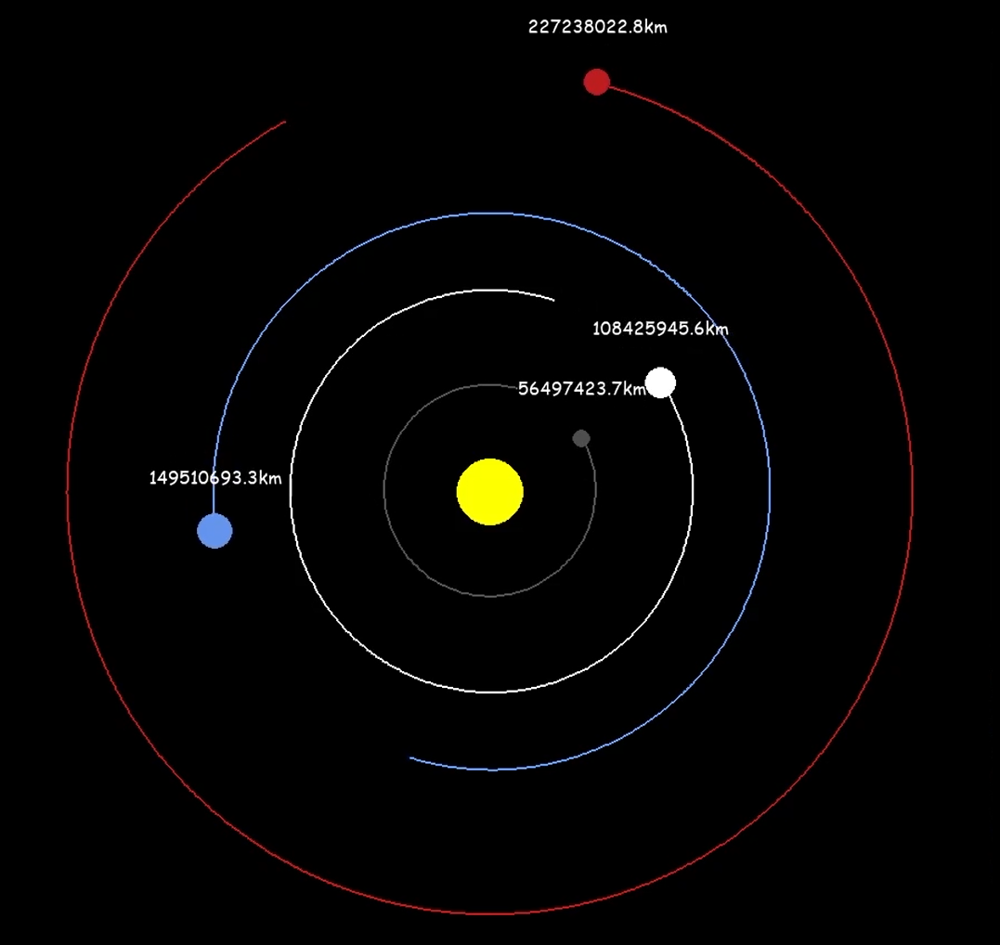

# SolarSystem
Uproszczona symulacja układu słonecznego z wykorzystaniem rzeczywistych wartości fizycznych.
Planety poruszają się po eliptycznych orbitach, przy każdej planecie pokazana jest aktualna odległość danej planety od słońca.

## Autor
- [Adam Kubiak](https://github.com/AdamKubiak),

### Prezentacja programu

